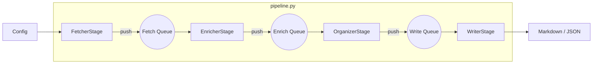

# Crawler Refactoring Plan: Native Python Pipeline

## 1. Overview
Refactor the existing `rss_crawler.py` into a modular, multi-stage pipeline architecture similar to `daft_crawler`, but implemented using **native Python threads and queues** (`queue.Queue`, `concurrent.futures.ThreadPoolExecutor`).

**Goals:**
*   **Decoupling**: Separate Fetching, Enriching, Organizing, and Writing logic.
*   **Streaming**: Use Queues to process data as it flows, reducing latency.
*   **Concurrency Control**: Fine-grained control over concurrency for different stages and source types (especially X/Twitter).
*   **Unified Entry**: Consolidate the main entry point into `pipeline.py`.

---

## 2. Directory Structure

```text
crawler/
├── stages/                  # [New] Component logic for each stage
│   ├── __init__.py
│   ├── source_fetcher.py    # FetcherStage: Hybrid concurrency (Serial X, Parallel others)
│   ├── content_enricher.py  # EnricherStage: Parallel content enrichment (Queue Consumer)
│   ├── llm_organizer.py     # OrganizerStage: Parallel LLM processing (Queue Consumer)
│   └── result_writer.py     # WriterStage: File writing & stats (Queue Consumer)
├── pipeline.py              # [Refactored] Main Entry Point & Coordinator
├── common.py                # [Existing] Shared utilities (Logger, Config)
├── content_fetcher.py       # [Existing] Business logic for enrichment
└── web_crawler.py           # [Reserved] Independent script
```

> **Note**: `rss_crawler.py` will be deleted.

---

## 3. Architecture & Data Flow

**Pattern**: Producer-Consumer Pipeline with Intermediate Queues.



**Data Object**:
A simple Python `dict` flows through the pipeline.
*   `fetch_q`: `{title, link, source_type, content...}`
*   `enrich_q`: `{..., extra_content, extra_urls}`
*   `write_q`: `{..., event, category, quality_score, detail...}`

---

## 4. Module Design Details

### A. `pipeline.py` (Coordinator & Entry Point)
*   **Responsibilities**:
    1.  **Initialization**: Load Config, Parse Sources.
    2.  **Setup**: Create 3 Queues (`fetch_q`, `enrich_q`, `write_q`) and instantiate 4 Stages.
    3.  **Execution steps**:
        *   Start `WriterStage`, `OrganizerStage`, `EnricherStage` (they wait for data).
        *   Start `FetcherStage` (starts producing data).
    4.  **Cascading Shutdown (Poison Pill Strategy)**:
        *   `fetcher.join()`: Wait for all fetching to complete.
        *   `enricher.stop()`: Inject `N` (worker count) `None` sentinels into `fetch_q`. Wait for completion.
        *   `organizer.stop()`: Inject `M` `None` sentinels into `enrich_q`. Wait for completion.
        *   `writer.stop()`: Inject `1` `None` sentinel into `write_q`. Wait for completion.

### B. `stages/source_fetcher.py` (FetcherStage)
*   **Input**: List of sources (Weixin, X, YouTube).
*   **Output**: `fetch_q`.
*   **Concurrency Strategy (Dual Pools)**:
    *   **General Pool**: `ThreadPoolExecutor(max_workers=5)` for Weixin/YouTube.
    *   **Restricted Pool**: `ThreadPoolExecutor(max_workers=1)` for X (Twitter).
        *   *Why Pool?* Future extensibility.
        *   *Logic*: Includes `random.uniform(sleep)` to prevent rate-limiting.
*   **Mechanism**: Iterates sources, submits to appropriate pool. Futures' callbacks put results into `fetch_q`.

### C. `stages/content_enricher.py` (EnricherStage)
*   **Input**: `fetch_q`.
*   **Output**: `enrich_q`.
*   **Concurrency**: `ThreadPoolExecutor(max_workers=5)`.
*   **Logic**:
    *   Workers loop on `fetch_q.get()`.
    *   If `None`: Break loop (Poison Pill).
    *   If X/YouTube: Call `content_fetcher` logic (heavy I/O).
    *   Else: Pass through.
    *   Put result to `enrich_q`.

### D. `stages/llm_organizer.py` (OrganizerStage)
*   **Input**: `enrich_q`.
*   **Output**: `write_q`.
*   **Concurrency**: `ThreadPoolExecutor(max_workers=5)`.
*   **Logic**:
    *   Workers loop on `enrich_q.get()`.
    *   If `None`: Break loop.
    *   Call LLM API.
    *   Put result to `write_q`.

### E. `stages/result_writer.py` (WriterStage)
*   **Input**: `write_q`.
*   **Concurrency**: Single Thread.
*   **Logic**:
    *   Loop on `write_q.get()`.
    *   If `None`: Generate `latest_batch.json` manifest, print summary, exit loop.
    *   Write Markdown file to disk immediately.
    *   Update in-memory stats (high/pending/excluded counts).

---

## 5. Execution Plan
1.  Create `crawler/stages/` directory.
2.  Implement `stages/source_fetcher.py` (Hybrid Fetcher).
3.  Implement `stages/content_enricher.py` (Worker Loop).
4.  Implement `stages/llm_organizer.py` (Worker Loop).
5.  Implement `stages/result_writer.py` (Writer & Stats).
6.  Implement `crawler/pipeline.py` (Coordinator).
7.  Verify functionality.
8.  Delete `crawler/rss_crawler.py`.
